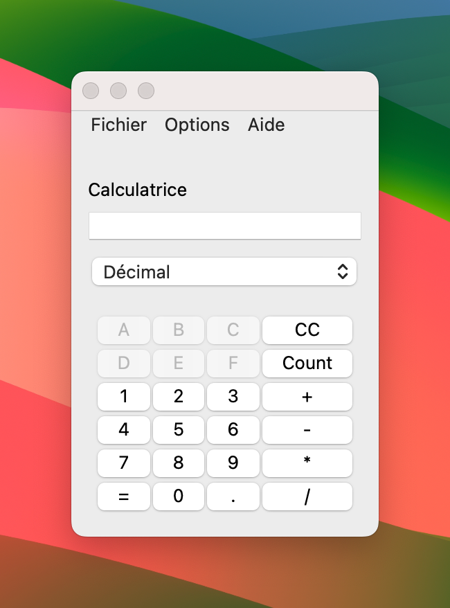

# Calculatrice avec Interface Graphique (Qt) en C++

Ce projet consiste en une calculatrice simple avec une interface graphique réalisée en C++ à l'aide du framework Qt. La calculatrice prend en charge les opérations de base ainsi que la conversion entre les bases décimale, binaire et hexadécimale.

## Fonctionnalités

- Opérations de base : addition, soustraction, multiplication, division.
- Conversion entre les bases : décimal, binaire et hexadécimal.
- Interface utilisateur conviviale avec des boutons pour les chiffres, les opérations et les conversions.

## Captures d'écran

## Comment exécuter le projet

1. Clonez le dépôt sur votre machine.
2. Ouvrez le projet avec votre environnement de développement C++ prenant en charge Qt.
3. Compilez et exécutez le projet.

## Utilisation

- Lorsque vous lancez l'application, vous verrez une interface graphique de calculatrice.
- Sélectionnez la base (Décimal, Binaire, Hexadécimal) à l'aide du menu déroulant.
- Utilisez les boutons pour effectuer des opérations ou saisir des chiffres.
- Les raccourcis clavier sont également disponibles pour certaines actions.

## Auteurs

- Clément JANTET
- Calliste RAVIX
